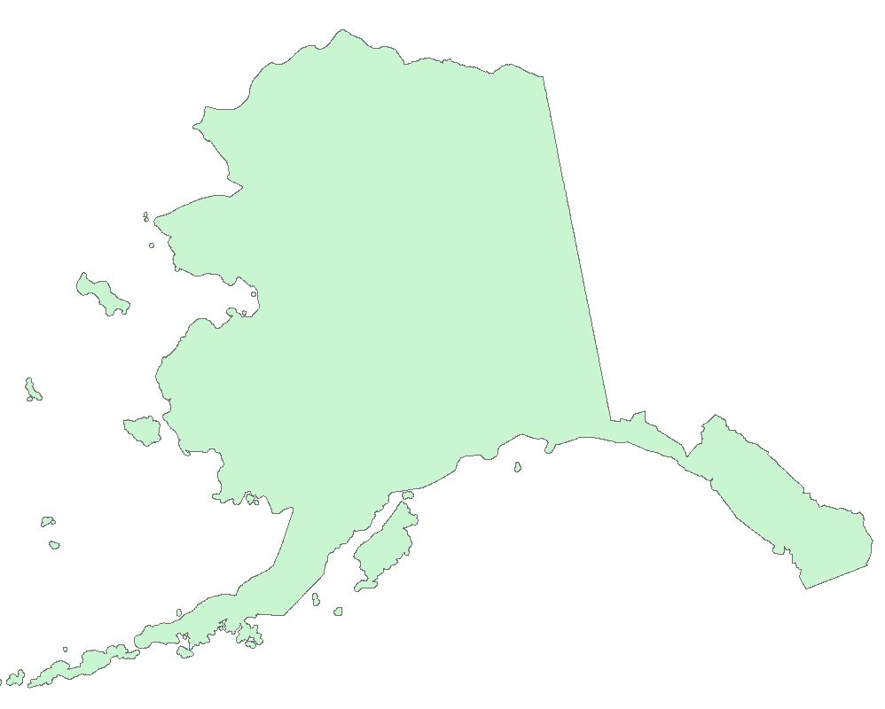
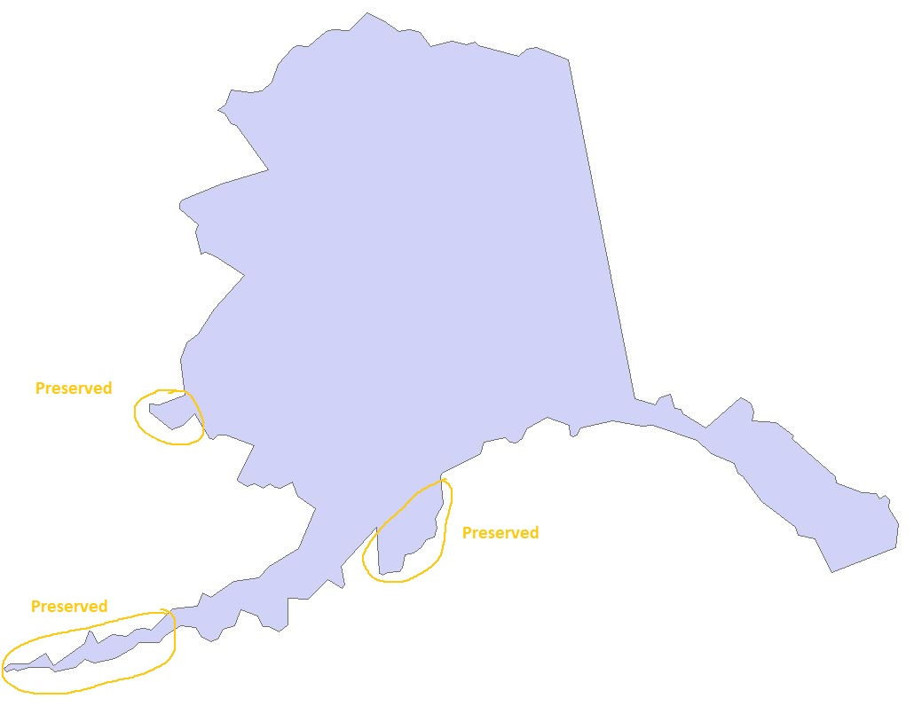

# MODIS_SnowCover_Workflow

## A MODIS (Moderate Resolution Imaging Spectroradiometer) snow cover data processing workflow written in Python based on my previous research project for Arctic Hydrology. 

In this workflow, I included open source geospatial analysis libraries such as GDAL/OGR, Geopandas, shapely and other widely used scientific computing libraries such as NumPy and SciPy. The workflow includes three major steps and each of the steps is provided by one Python file. This is to ensure a flexible adoptation for processing other data products from EarthData portal, such as Landsat.  

1.	**nsidc-download_MODIS.py**: Automated download of MODIS swaths for snow cover products (Terra and Aqua) for customized user inputs. MODIS snow cover L3 product is computed using the NDSI (Normalized Difference Snow Index), based on the unique signature of snow reflectance differences between visible (high) and shortwave infrared bands (low). This script is directly adopted from NSIDC data download portal but has been improved to allow user input of interested spatial boundary (a polygon shapefile) and a more accurate simplification for the query boundary. Here is the link to the NSDIC download portal (click “Download” tab): https://nsidc.org/data/MOD10A1/versions/6

	I found an issue when I was trying to download the snow cover product using a polygon shapeflie of Alaska. The shapefile vertices were simplified to meet the querying requirements. However, it is obvious that some small parts (islands) of Alaska has been removed from the original polygon (see figures below). 
	
	
	<figcaption>Alaska boundary</figcaption>
	
	<figcaption>NSDIC simplified boundary</figcaption>
	
	This can potentially cause the missing of some swaths from the querying results. In my script, I updated the method to generate a more inclusive geometry, so these parts are preserved in the simplified polygon (see figures below). 

	
	<figcaption>My version of simplified boundary</figcaption>	
	
	The inputs from users are the product name – such as MOD10A1 (Terra) and MYD10A1 (Aqua), time range, and a polygon shapefile for the processing boundary. The script will prompt the users to enter a registered username and password on EarthData portal. Please download this script to a working directory and it will automatically download the HDF5 files for MODIS snow cover.

2.	**process_MODISNDSI.py**: Process the downloaded HDF5 files of MODIS swaths, including the extraction of sublayer for snow cover (NDSI), translate the raster grids to GeoTiff format, merge and reproject to a more workable map projection (rather than the original Sinusoidal projection), and then crop the raster images into interested area (in this case Alaska). The result files are generated for daily MODIS snow cover in the shapefile boundary. The inputs from users are path of the downloaded HDF5, time range, product name, and a polygon shapefile for the processing extent. The intermediate data are stored in the subdirectory ./tiff_process and the final GeoTiff files are stored in the subdirectory ./tiff_out. Note that the polygon shapefile for this script needs to be in a PCS (projected coordinate system) to crop the merged raster images correctly, because the Sinusoidal projection is already a PCS.  

3.	**removecloud.py**: Remove cloud effects from the processed snow coverage raster files using sensor fusion techniques. Cloud is always an issue in the optical satellite imagery analysis and there is no exception for MODIS data. The good news is that two MODIS sensors are available: Terra and Aqua, which operate at different time of the day: morning and afternoon and from reserved polar orbit directions. This provides users a unique opportunity to fusion these two sensors to remove some of these cloud pixels by leveraging the additional information. One of the strategies is to apply a spatial filter to remove the “hole” created by a cloud pixel based on its neighboring pixels. If the majority of its neighboring pixels are snow, then the pixel is converted back to snow and the NDSI is computed using the average of its neighboring pixel. In this script, an efficient convolution operator using SciPy is implemented as the majority filter. Users only need to provide the file path for the outputs of Terra and Aqua using the process_MODISNDSI.py script.

	The other script -- stats.py: This is a script to compute a boxplot for the comparison between Terra and Fusion snow products using the different represented categories of the pixel values. The results show a significant improvement for the snow cover pixels and reduce of the cloud pixels (see figure below). 
	
	

	
	

	
	“No decision” pixels also reduced. Water pixels are not changed because these have a much higher certainty and cannot be converted back to snow pixels, thus are not processed further in this workflow. The visulization for Terra and funsion can be found there. Note the images are from Janurary 2016 so part of Alaska has very short daylight hours.  
	
	
	
	
	
	

### I included some example files that are generated from this workflow in the "example_files" folder.
